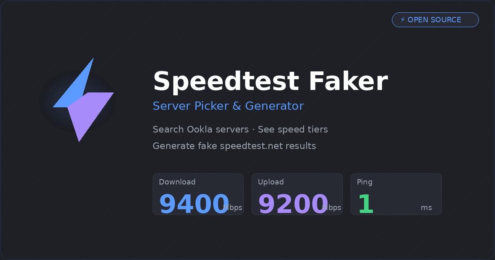

<p align="center">
  
</p>

<h1 align="center">⚡ Speedtest Faker</h1>

<p align="center">
  Search Ookla servers · See speed tiers · Generate fake speedtest.net results with real links
</p>

<p align="center">
  <a href="https://deadboy18.github.io/speedtest-faker/">
    
  </a>
  &nbsp;
  
  &nbsp;
  
</p>

---

## What Is This?

A tool that generates **real speedtest.net result links** with whatever speed values you want. Pick an Ookla server, set your fake download/upload/ping, hit generate — get a shareable link and image that look identical to a real test.

**🔗 [Try the live demo →](https://deadboy18.github.io/speedtest-faker/)**

> [!NOTE]
> Works directly in the browser — no Python required. If your browser blocks the Ookla API (CORS), run `python server.py` locally as a fallback.

---

## Features

- **🔍 Server Search** — Live search Ookla's 15,000+ server database by city, country, or ISP
- **📊 Speed Tier Badges** — Estimated max speed (10G / 40G / 100G) based on known providers
- **⚡ Quick Presets** — One-click fills for 1 Gbps, 10 Gbps, Fiber, Cable, 5G, Trash WiFi, and more
- **🔗 Real Link Generation** — Produces actual `speedtest.net/result/XXXXX` URLs via the Python backend
- **📋 Full Server List** — Browse and filter the complete Ookla server database
- **🌍 Auto Timezone** — Timestamp info auto-detects your timezone so you know what the result will show
- **📱 Mobile Friendly** — Responsive card layout, touch-optimized buttons, works on phones
- **🖼️ Link Previews** — Open Graph meta tags for rich previews when sharing on WhatsApp, Discord, Telegram
- **🥚 Easter Eggs** — [There are a few...](#-easter-eggs)

---

## Quick Start

### Option 1: GitHub Pages (no install)

The [live demo](https://deadboy18.github.io/speedtest-faker/) runs entirely in the browser. Server search and result generation both work directly via Ookla's API — no backend needed. Some browsers may block the API (CORS); if so, use Option 2.

### Option 2: Local server (CORS-proof)

Run the Python server for guaranteed functionality — bypasses any browser CORS restrictions.

```bash
git clone https://github.com/deadboy18/speedtest-faker.git
cd speedtest-faker
python server.py
```

Open **http://localhost:8888** — that's it. No pip installs, no dependencies, pure stdlib.

### Option 3: Just open the HTML

Double-click `index.html`. Same browser-direct generation as GitHub Pages.

---

## How It Works

1. **Server Search** queries Ookla's public API:
   ```
   https://www.speedtest.net/api/js/servers?engine=js&search=...
   ```

2. **Result Generation** POSTs to Ookla's result endpoint with your fake values:
   ```
   https://www.speedtest.net/api/api.php
   ```

3. The POST requires an MD5 hash computed as:
   ```
   md5("$ping-$upload-$download-297aae72")
   ```

4. Ookla returns a `resultid` → maps to a real `speedtest.net/result/XXXXX` URL with a shareable image.

---

## Speed Tier Estimates

The tier badges are heuristic guesses based on the server's sponsor name. Ookla's API doesn't expose actual server bandwidth.

| Tier | Typical Providers |
|------|-------------------|
| **100 Gbps** | i3D.net, FDCservers, Hetzner, OVH, Vultr, Leaseweb, Hurricane Electric |
| **40 Gbps** | Comcast, AT&T, Deutsche Telekom, BT, Virgin Media, Orange, Swisscom |
| **10 Gbps** | Most ISPs, regional providers, smaller telecoms |

---

## 🥚 Easter Eggs

<details>
<summary><b>Click to reveal</b> (or find them yourself — open DevTools console for hints)</summary>

<br>

| Trigger | How | What Happens |
|---------|-----|--------------|
| **Konami Code** | `↑↑↓↓←→←→BA` on keyboard | Matrix rain (15s auto-stop) |
| **Logo Clicks** | Click the ⚡ logo 7 times fast | Party mode + confetti |
| **Footer** | Triple-click the footer text | Secret credits toast |
| **Shake** | Shake your phone | Confetti burst |
| **Search: "help"** | Type `help` in search + Enter | Konami code hint |
| **Search: "speedtest"** | Type `speedtest` + Enter | Snarky message |
| **Search: "ookla"** | Type `ookla` + Enter | Who? |
| **Speed: 69 / 6969** | Set download or upload | Nice 😏 |
| **Speed: 420** | Set download or upload | Blazing fast 🔥 |
| **Speed: 42** | Set download or upload | Hitchhiker's Guide 🌌 |
| **Speed: 1337** | Set download or upload | h4x0r detected 🎮 |
| **Speed: 9999 + 9999** | Set both DL and UL | UNLIMITED POWER ⚡ |
| **Ping: 0** | Set ping to 0 | Time traveler? ⏳ |
| **Ping: ≥ 9000** | Set ping to 9000+ | It's over 9000!! |
| **Speed: 0.01** | Set download or upload | NASA WiFi 🐌 |

**Console bonus:** Type `easter()` in DevTools console for the full table.

</details>

---

## Files

```
├── index.html      ← The UI (works standalone or hosted)
├── server.py       ← Python backend for result generation
├── og-image.png    ← Social preview image (WhatsApp/Discord/Telegram)
└── README.md
```

---

## Timestamp Note

Speedtest.net result timestamps use **GMT/UTC**, not your local timezone. The tool auto-detects your timezone and shows you the offset in the Tools tab — so if you're at UTC+8 and generate at 11 PM local, the result shows 3 PM.

---

## License

For educational and prank purposes only. Not affiliated with Ookla.
